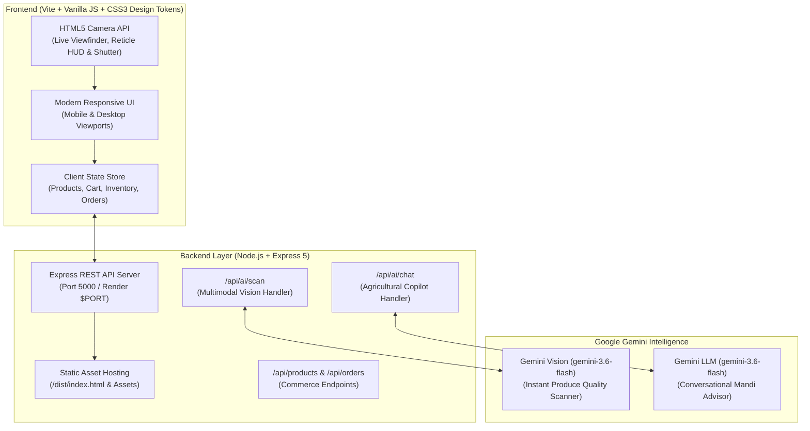

# 🌾 Kisan Setu (किसान सेतु) — Direct Farm-to-Market AI Supply Chain Platform

> **"Kisaan ka haq, seedha market tak — Bina kisi bicholiye ke!"**  
> Ek modern, transparent aur AI-powered platform jo Farmer Producer Organizations (FPOs) ko bulk buyers (supermarkets, hotels, retail stores) ke sath seedha jodta hai.

[](https://nodejs.org/)
[](https://vitejs.dev/)
[](https://expressjs.com/)
[](https://aistudio.google.com/)
[](https://render.com/)

---

## 📌 1. Project Overview (Yeh Project Kya Hai?)

### 🚨 Traditional Mandi System Ki Asli Samasya (The Problem)
India ke traditional agriculture supply chain me fasal kisaan ke khet se nikal kar customer tak pahunchne ke beech **4 se 7 middlemen (bicholiye / aadhatiyas / wholesalers / traders)** aate hain. Iski wajah se:
* **Kisaan ko bahut kam daam milta hai:** Retail price ka mushkil se **25% – 35%** kisaan ke haath aata hai.
* **Buyers ke liye rates high ho jaate hain:** Har middleman apna commission add karta hai, jisse restaurants aur supermarkets ko mehenga khareedna padta hai.
* **Fasal kharab hona (Post-harvest spoilage):** Coordinate logistics aur tracking na hone ki wajah se 20%–30% taaza sabziyan aur phal raste me hi sad jaate hain.
* **Subjective Quality Disputes:** Produce ki grading manual hoti hai. Traders manmarzi se quality kharab bata kar daam gira dete hain.

### 💡 Kisan Setu Ka Solution
**Kisan Setu ("Farmers' Bridge")** ek fair, technology-driven platform hai jo:
1. **Direct FPO-to-Buyer Connect:** Kisaano ko sidhe verified bulk buyers se jodata hai, jisse kisaan ko **75% – 85% tak fair farmgate price** milta hai.
2. **Google Gemini Multimodal AI Quality Scanner:** Smartphone camera se fasal ki photo click karke AI turant Ripeness %, Firmness, Defect % aur Grade A certification nikal deta hai.
3. **100% Transparent Price Breakdown:** Har kg ke daam me saaf dikhta hai ki Kisaan ko kitna mila, Logistics kitna laga, aur Buyer ne mandi ke muqable kitna bachaya.
4. **Ask Kisan AI Copilot:** 24/7 conversational advisor jo mandi rates aur harvesting timing par Hinglish, Hindi aur English me guide karta hai.
5. **Smart Milk-Run Logistics Pooling:** Aas-paas ke kheton (jaise Sonipat aur Panipat) ka mal ek sath truck me pick karke travel distance, diesel kharch aur heat spoilage kam karta hai.

---

## 🏗️ 2. System Architecture (System Kaise Kaam Karta Hai?)



---

## ✨ 3. Zabardast Features (Key Features Deep-Dive)

### 1. 📷 Live Camera & Gemini Vision Quality Scanner
* **In-Browser Live Camera Viewfinder:** HTML5 `MediaDevices API` ke zariye browser me live camera khulta hai jisme high-tech reticle HUD, corner focus guides aur animated scan line aati hai.
* **Front / Rear Camera Flip:** Mobile phone par back camera se fasal scan karna aur front camera switch karna ek click me possible hai.
* **Instant Multimodal AI Analysis:** Photo click hote hi backend **Google Gemini Vision** ko bhejta hai, jo detailed breakdown return karta hai:
  * **Ripeness Score:** (Jaise 94.6% optimal coloration)
  * **Firmness Index:** (Jaise 9.1 / 10 cell wall integrity)
  * **Defect Rate:** (Blemish / daag dhabbe kitne hain)
  * **Estimated Shelf Life:** (Jaise 4–5 Days)
  * **Quality Certification:** (Grade A Certified / Premium)
  * **Suggested Fair Price:** (Market standard ke mutabik fair price ₹/kg)
* **🚀 One-Click "Post Picture to Marketplace":** Scanned produce aur uski verified photo ko kisaan turant marketplace me live list kar sakta hai!

### 2. 💬 Ask Kisan AI Copilot (Agricultural Assistant)
* Header aur floating button dono jagah available hai.
* Google Gemini se powered prompt jo Delhi-NCR mandis (Azadpur, Sonipat, Panipat) ke context me trained hai.
* Natural language me sawaal pooch sakte hain (Hindi, Hinglish ya English):
  * *"Sonipat me aaj tamatar ka mandi rate kya chal raha hai?"*
  * *"Delhi-NCR ke liye gobhi (cauliflower) kab harvest karni chahiye?"*
  * *"Barish ke baad fasal ko kharab hone se kaise bachayein?"*

### 3. ⚖️ Transparent Pricing Story (Doodh Ka Doodh, Paani Ka Paani)
Jab koi buyer kisi bhi produce par click karta hai, ek interactive cost breakdown open hota hai:
* **Kisaan Ko Mila (Farmer Payout):** ₹27.00/kg (Total ka ~86%)
* **Cold-Chain / Smart Logistics:** ₹3.00/kg
* **Platform Quality & Verification:** ₹1.50/kg
* **Buyer Ka Final Rate:** ₹31.50/kg
* **Bachat (Savings):** Mandi ke retail rate (₹36–₹42/kg) ke muqable buyer ki direct bachat clear dikhti hai!

### 4. 🚚 Intelligent Milk-Run Logistics & Live Interactive GPS Map
* **Real Interactive Live Map (Leaflet.js + OpenStreetMap):** Abstract CSS mock ki jagah actual live geographic map integrate kiya gaya hai.
* **Dual Layer Switcher:** Ek click me **🗺️ OpenStreetMap Road View** aur **🛰️ High-Resolution Satellite View (Esri)** ke beech switch kar sakte hain.
* **Exact Farm Coordinates & Grand Trunk Road Route:**
  * Stop 1: 🌾 **Varun FPO (Sonipat, Haryana)** — `[28.9931, 77.0151]` (730 kg Organic Tomatoes)
  * Stop 2: 🥦 **Savitri Farms (Panipat, Haryana)** — `[29.3909, 76.9635]` (970 kg Snow White Cauliflower)
  * Stop 3: 🏢 **North Hub Cold Facility (Singhu Border)** — `[28.8722, 77.1265]` (QC scan & pre-cooling)
  * Stop 4: 🛒 **Green Basket Stores (Delhi NCR / Shalimar Bagh)** — `[28.7166, 77.1568]` (Direct retail delivery)
* **Live Moving Reefer Truck (`🚚`):** **"Start Live Route"** aur **"Next Stop"** dabane par truck smooth animation ke sath map par move karta hai, live telemetry update hoti hai (+3.8°C Cold Chain OK, 44 km/h speed), aur popup khulta hai.
* **Interactive Stop Focusing & Recenter:** Sequence list me kisi bhi stop par click karne par map turant us stop par center ho jata hai, aur **"🎯 Recenter"** se poora 48 km route ek sath fit ho jata hai.
* **Bachat:** Dono FPOs ka maal ek hi trip me lene se **18 km duplicate travel**, **₹160 diesel freight** aur **22 kg heat spoilage** ki bachat hoti hai.

### 5. 📊 AI Pricing & Revenue Simulator
* Farmer dashboard me live sliders:
  * **Batch Volume (kg):** 500 kg se 5,000 kg tak
  * **Delivery Radius (km):** 10 km se 60 km tak
* Sliders move karte hi **Demand Score (0-100)**, **Suggested Price (₹/kg)**, **Expected Buyer Match Time** aur **Projected Total Revenue** real-time me recalculate hote hain.

### 6. 🛒 Direct B2B Marketplace & Live Order Tracking
* Categories: Vegetables, Fruits, Available Today, aur Distance filter.
* Quantity Stepper (+ / - 50 kg) aur Cart Modal.
* Multi-stage live milestone tracker:
  * `Order Confirmed` ➔ `Produce Packed` ➔ `Pickup Today` ➔ `In Transit` ➔ `Delivered`.

---

## 💻 4. Tech Stack (Kaunsi Technologies Use Hui Hain?)

| Area | Technology | Purpose & Details |
| :--- | :--- | :--- |
| **Frontend Framework** | HTML5, Vanilla JavaScript (ES Modules) | Zero virtual-DOM overhead, super-fast performance |
| **Styling & Theme** | Modern Vanilla CSS3 (Custom Tokens) | Glassmorphism, agricultural emerald green theme, dark mode accents |
| **Build System** | Vite 7 | Lightning-fast Hot Module Replacement (HMR) aur production bundling |
| **Backend Framework** | Node.js + Express 5 | Lightweight REST API, static asset server, multipart processing |
| **Generative AI** | Google Gemini (`gemini-3.6-flash`) | Multimodal quality vision analysis & conversational copilot |
| **Camera Integration** | HTML5 MediaDevices API | Native camera access, viewfinder canvas snap, orientation toggle |
| **Cloud Hosting** | Render.com & Vercel | One-click full-stack deployment with auto health checks |

---

## 📁 5. Directory Structure (Folder Aur Files Ka Setup)

```text
d:/Kisan setu/
│
├── .env                  # Private API keys (GEMINI_API_KEY, PORT) [Git me commit nahi hota]
├── .env.example          # Sample environment variables reference
├── .gitignore            # Git ignore rules (node_modules, dist, .env)
├── package.json          # Project scripts aur dependencies (express, cors, vite)
├── render.yaml           # Render infrastructure-as-code deployment blueprint
├── vite.config.js        # Vite bundler aur proxy configuration
├── index.html            # Main HTML entry file
│
├── server/
│   └── index.js          # Express server, Google Gemini API handlers, REST endpoints
│
├── src/
│   ├── main.js           # Frontend logic, state store, camera controller, UI renderers
│   └── style.css         # Complete CSS design system, reticle animations, responsive layout
│
├── dist/                 # Production build files (jab `npm run build` run hota hai)
└── TEAM_EXPLANATION.md   # Project architecture aur evaluation guide
```

---

## ⚙️ 6. Local Setup & Installation (Apne System Par Kaise Chalaye?)

### 📋 Requirements
* **Node.js** v18 ya usse upar ka version install hona chahiye.
* **Git** installed hona chahiye.
* (Optional) **Google Gemini API Key** (Free key lene ke liye [Google AI Studio](https://aistudio.google.com/) par jayein).

### 🛠️ Step-by-Step Setup

#### 1. Repository Clone Karein
```bash
git clone https://github.com/varuns47866-creator/kisan-setu.git
cd kisan-setu
```

#### 2. Dependencies Install Karein
```bash
npm install
```

#### 3. `.env` File Setup Karein
`.env.example` ko copy karke `.env` file banayein:
```bash
# Windows PowerShell me:
copy .env.example .env

# Ya bash/terminal me:
cp .env.example .env
```

`.env` file open karein aur apna Google Gemini API Key dalein:
```env
PORT=5000
NODE_ENV=development
GEMINI_API_KEY=AIzaSyYourActualKeyHere
GEMINI_MODEL=gemini-3.6-flash
```
*(Agar Gemini key nahi bhi hai, tab bhi app smart rule-based fallback responses ke sath smoothly chalta hai!)*

#### 4. Project Ko Run Karein

Aap do alag-alag terminals me Frontend aur Backend chala sakte hain:

**Terminal 1 — Backend Express Server:**
```bash
npm start
# Server start hoga: http://localhost:5000
```

**Terminal 2 — Frontend Vite Dev Server:**
```bash
npm run dev
# Frontend open hoga: http://localhost:5173
```

Browser me `http://localhost:5173` kholein aur Kisan Setu ka maza lein! 🚀

---

## 🎬 7. Complete Demo Walkthrough (Live Presentation Script)

Agar aap kisi judge, team member ya investor ko demo dikha rahe hain, to is sequence me dikhayein:

1. **Homepage & Mission:**
   * Homepage par aakar bataiye ki Kisan Setu ka lakshya kya hai: Direct FPO trade aur 86%+ farmer payout.
   * Top stats counters highlight karein: 86.4 tons moved, ₹2.1 Lakh farmer savings.
2. **Grower Workspace ("I’m a farmer"):**
   * Top navigation me **"I’m a farmer"** par click karein.
   * **Varun Singh (Varun FPO, Sonipat)** ka dashboard dikhai dega jisme live harvest inventory aur AI price advisor cards hain.
3. **AI Quality Scan (Camera & Gemini Vision) — The "WOW" Moment! 🌟:**
   * **"Launch AI Quality Scan"** button click karein.
   * **"📷 Live Camera"** par click karke browser camera open karein (ya sample crop jaise 🍅 Tomatoes choose karein).
   * Circular **Shutter Button** dabakar snapshot lein.
   * **"⚡ Scan Picture with Gemini AI Vision"** dabayein.
   * Dekhein kaise AI instant Ripeness (94%), Firmness (9.1/10), Grade A certificate aur fair price suggest karta hai.
   * **"🚀 Post Scanned Lot & Picture to Marketplace"** click karein — fasal verified photo ke sath turant live marketplace me list ho jayegi!
4. **AI Demand Simulator:**
   * Volume (kg) aur Delivery Radius ke sliders move karke live Demand Score aur Expected Revenue ka calculation dikhayein.
5. **Marketplace & Transparent Price Breakdown:**
   * **"Marketplace"** screen par jayein.
   * Tamatar ya Gobhi ke card par click karein aur **Transparent Price Breakdown** khol kar dikhayein (Kisaan share, logistics fee, buyer savings).
   * Quantity badhayein aur **"Add to Cart"** karein.
6. **Cart & Order Milestone Tracking:**
   * Cart open karke **"Confirm Order"** karein.
   * Live milestone status (Confirmed ➔ Packed ➔ In Transit) dikhayein.
7. **Milk-Run Logistics:**
   * **"Logistics"** tab par jayein.
   * **"Start Live Route"** aur **"Next Stop"** daba kar dikhayein kaise ek hi truck Sonipat aur Panipat se produce utha kar Delhi-NCR delivery karta hai aur diesel/spoilage bachata hai.
8. **Ask Kisan AI Copilot:**
   * Floating bot icon par click karein.
   * Mandi rates ya harvesting par sawaal poochein aur Gemini ka real-time Hinglish response dekhein.

---

## 🔌 8. API Endpoints (Backend REST Reference)

| Method | Endpoint | Description | Sample Request / Response |
| :--- | :--- | :--- | :--- |
| `GET` | `/api` | API status aur endpoints ki list | `{ "status": "online", "grower": "Varun FPO" }` |
| `GET` | `/api/health` | Render deployment health check | `{ "status": "ok", "uptime": 124 }` |
| `GET` | `/api/products` | Marketplace me saare active produce lana | List of products with stock, price, grade |
| `POST` | `/api/products` | Nayi harvest list karna (image aur grade ke sath) | Body: `{ name, quantity, price, grade, image }` |
| `GET` | `/api/orders` | Recent orders aur unka tracking status | Array of orders with statusStep (1 to 5) |
| `POST` | `/api/orders` | Naya B2B order place karna | Body: `{ produceName, qty, buyer, farm }` |
| `POST` | `/api/ai/scan` | Crop photo ko Gemini Vision se grade karna | Body: `{ imageBase64, cropType }` |
| `POST` | `/api/ai/chat` | Kisan AI Copilot se agricultural guidance lena | Body: `{ query: "Tamatar ka rate kya hai?" }` |
| `GET` | `/api/logistics` | Active truck route aur pooled savings data | `{ route: [...], savings: { kmSaved: 18 } }` |

---

## 🚀 9. Production Deployment Guide (Live Deployment)

### 🔹 Option 1: Full-Stack on Render (Sabse Easy / Recommended)
Ye project **Render Blueprint (`render.yaml`)** ke sath ready hai:
1. Apne code ko **GitHub** par push karein.
2. [Render.com](https://render.com/) par login karein aur **New + > Web Service** select karein.
3. Apna GitHub repo connect karein.
4. Render automatically `render.yaml` se settings detect kar lega:
   * **Build Command:** `npm install && npm run build`
   * **Start Command:** `npm start`
   * **Health Check:** `/api/health`
5. Environment variables me apna `GEMINI_API_KEY` add karein.
6. **Deploy** par click karein. Aapka frontend aur backend dono ek hi URL par live ho jayenge (jaise: `https://kisan-setu.onrender.com`).

### 🔹 Option 2: Frontend on Vercel + Backend on Render
Agar aap frontend ko Vercel ke CDN par host karna chahte hain:
1. Vercel dashboard me repo import karein.
2. Build preset **Vite** automatically select ho jayega.
3. Environment Variable add karein:
   * `VITE_API_URL` = `https://your-backend.onrender.com`
4. Deploy karein!

---

## 🌟 10. Social Impact & Future Vision (Kisaan Ki Pragati)

* **Kisaan Ki Aamdani me 2x-3x Badhotri:** Intermediary commission khatam hone se FPOs ko unki mehnat ka sahi daam milta hai.
* **Perishable Waste me 40% kami:** Fast route pooling aur direct cold store routing se fasal raste me nahi sadti.
* **Fair Pricing Transparency:** Buyers ko pata hota hai ki unka diya paisa seedha kisaan ki jeb me ja raha hai, kisi middlemen ki nahi.
* **Future Additions:**
  * Multi-lingual Voice bot (Haryanvi, Punjabi, Bhojpuri support).
  * IoT Soil moisture & cold-truck temperature tracking integration.
  * UPI & Smart Escrow payments for instant payout upon delivery acceptance.

---

## 👨‍💻 11. Team & Contribution

* **Project Lead / Creator:** Varun Singh ([varuns47866-creator](https://github.com/varuns47866-creator))
* **Mission:** Empowering Indian farmers through transparent, AI-driven technology.
* **Feedback & Queries:** Contributions, issues aur pull requests open hain! 

---

<div align="center">
  <b>🌾 Kisan Setu — Bridging the gap between Farms and Markets 🚜</b>
</div>
