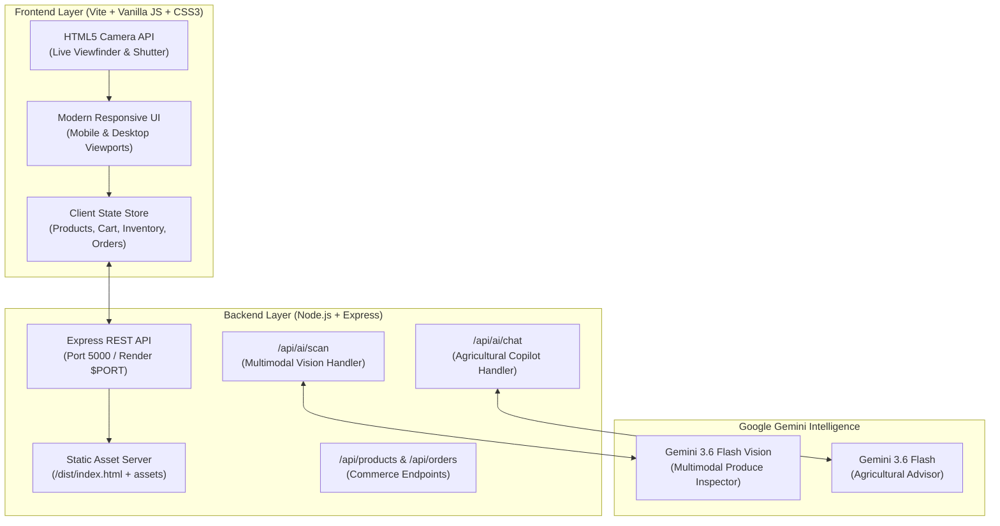

# 🌾 Kisan Setu (किसान सेतु) — Team Project Guide & Technical Overview

> **A Fair, Transparent, AI-Powered Farm-to-Market Supply Chain Platform**  
> Prepared for the Team, Stakeholders, and Demonstrations.

---

## 📌 1. Executive Summary

### The Problem in Traditional Agriculture
In India's current agricultural supply chain, produce changes hands through 4 to 7 layers of intermediaries (local aggregators, commission agents, regional mandis, wholesale dealers, local traders).
* **Farmers** typically receive only **25% – 35%** of the final retail price.
* **Buyers (supermarkets, restaurants, stores)** pay inflated prices due to stacked markups.
* **Spoilage & Wastage:** 20%–30% of perishable harvests rot in transit due to uncoordinated transport and lack of cold-chain tracking.
* **Subjective Quality Disputes:** Produce grading is manual and arbitrary, often weaponized to slash prices paid to growers.

### The Kisan Setu Solution
**Kisan Setu ("Farmer's Bridge")** connects Farmer Producer Organizations (FPOs) directly with verified commercial buyers (supermarkets, retail chains, cloud kitchens) across Delhi-NCR and Haryana.
1. **Fair Price Guarantee:** Farmers receive up to **75% – 85%** of value, with completely transparent price breakdowns visible to both buyer and seller.
2. **Google Gemini Multimodal AI Vision:** Instant crop quality grading via live camera or uploaded photo (evaluating ripeness, firmness, defects, shelf-life, and fair price).
3. **Conversational Kisan AI Copilot:** Live market advisory answering queries in English and Hindi on mandi rates and harvesting timing.
4. **Intelligent Route Pooling:** Shared milk-run logistics consolidating pickups across nearby farms to cut kilometers, freight costs, and heat spoilage.

---

## 🏗️ 2. System Architecture



---

## 🚀 3. Key Features Breakdown

### 1. 📷 Live Camera & Gemini Vision Quality Scanner
* **Live Camera Viewfinder:** Uses the HTML5 `navigator.mediaDevices.getUserMedia` API with a high-tech reticle HUD, corner guides, and animated scanning laser.
* **Camera Flip:** Easily switch between rear (produce scanning) and front cameras on smartphones and tablets.
* **Instant Snapshot & Upload:** Farmers can snap a live photo or upload an existing image from disk.
* **Multimodal Analysis:** The backend transmits the image to **Google Gemini 3.6 Flash**, which inspects:
  * **Ripeness %** (e.g. 94.6% optimal coloration)
  * **Firmness Index** (e.g. 9.1 / 10 cell wall integrity)
  * **Surface Defect %** (blemish density)
  * **Estimated Shelf Life** (e.g. 4–5 Days)
  * **Certified Grade** (Grade A Certified / Premium)
  * **Suggested Fair Farmgate Price** (calculated in ₹/kg)
* **🚀 One-Click "Post Picture to Marketplace":** Farmers can immediately list the inspected lot with its certified grade and **verified photograph** live in the marketplace.

### 2. 💬 Ask Kisan AI Copilot
* Built into the top navigation and floating quick-access button.
* Powered by Google Gemini with an agricultural context prompt tuned for Indian growers and Delhi-NCR mandis.
* Responds to voice-like natural questions in English, Hindi, and Hinglish regarding:
  * Today's recommended crop rates vs. Azadpur / Sonipat mandi averages
  * Optimal harvesting times to prevent heat spoilage
  * Disease symptoms and storage advice
  * Direct buyer connections and logistics consolidation

### 3. ⚖️ Algorithmic Price Transparency
* When buyers click any produce card in the marketplace, an interactive modal reveals the transparent cost breakdown:
  * **Farmer Receives:** (e.g. ₹27.00/kg)
  * **Pickup & Smart Logistics:** (₹3.00/kg)
  * **Platform Verification & Quality Assurance:** (₹1.50/kg)
  * **Buyer Final Cost:** (₹31.50/kg)
  * **Buyer Savings:** Clearly shows savings compared to traditional wholesale mandi markups (₹36–₹42/kg).

### 4. 🚚 Intelligent Logistics Route Simulation
* Simulates milk-run logistics across Sonipat, Panipat, North Hub, and Delhi NCR.
* Demonstrates how bundling **Varun FPO (730 kg)** and **Savitri Farms (970 kg)** into a single 48 km trip cuts 18 km of duplicate travel, saves ₹160 in diesel freight, and prevents 22 kg of heat spoilage.
* Features interactive route step advance: **Stop 1 (Varun FPO)** ➔ **Stop 2 (Savitri Farms)** ➔ **Stop 3 (North Hub Check)** ➔ **Stop 4 (Green Basket Stores Delivery)**.

### 5. 📊 AI Pricing & Revenue Demand Simulator
* Interactive sliders for:
  * **Batch Volume (kg):** 500 kg to 5,000 kg
  * **Delivery Radius (km):** 10 km to 60 km
* Dynamically recalculates the Demand Index (0–100), Suggested Price (₹/kg), Expected Buyer Match Time (hours), and Total Projected Revenue in real time.

---

## 💻 4. Technical Stack

| Area | Technology | Purpose |
| :--- | :--- | :--- |
| **Frontend Core** | HTML5, JavaScript (ES Modules) | Lightweight, lightning-fast rendering without virtual-DOM overhead |
| **Styling** | Custom Vanilla CSS (Design Tokens) | High-performance glassmorphism, responsive grid, tailored agricultural theme |
| **Build Tool** | Vite 7 | Blazing-fast HMR and optimized production bundle |
| **Backend** | Node.js + Express 5 | REST API, static asset hosting, image processing |
| **AI Vision & LLM** | Google Gemini (`gemini-3.6-flash`) | Multimodal produce inspection and conversational copilot |
| **Camera Feed** | HTML5 MediaDevices API | Native in-browser live camera stream and canvas frame capture |
| **Deployment** | Render.com | Unified full-stack Node.js web service with zero-downtime health checks |

---

## 📂 5. Directory & File Structure

```
d:/Kisan setu/
│
├── .env                  # Local environment secrets (GEMINI_API_KEY, PORT) [Git-Ignored]
├── .env.example          # Template showing configuration for team members
├── .gitignore            # Ignores node_modules, dist, and .env files
├── package.json          # Dependencies (express, cors, vite) and scripts
├── render.yaml           # Infrastructure-as-Code Blueprint for Render deployment
├── vite.config.js        # Vite build and development server configuration
├── index.html            # SPA mount point and SEO meta tags
│
├── server/
│   └── index.js          # Express server, Gemini API handlers, REST endpoints, static hosting
│
├── src/
│   ├── main.js           # Client application logic, state manager, camera controller, UI components
│   └── style.css         # Complete design system, camera viewfinder styles, responsive layouts
│
└── dist/                 # Production-compiled assets served by Express on Render
```

---

## 🎬 6. Step-by-Step Demo Script (For Presentations & Team Walkthroughs)

Follow this 5-minute flow to showcase the entire platform:

1. **Homepage Introduction:**
   * Open the app. Explain the mission: direct FPO trade with transparent pricing.
   * Highlight the live platform metrics: 86.4 tons moved, ₹2.1L saved, 92% direct farmer share.

2. **The Grower (Farmer) Workspace:**
   * Click **"I’m a farmer"** in the top navigation.
   * View the grower dashboard for **Varun Singh (Varun FPO, Sonipat)**.
   * Demonstrate the **AI Price Advisor** cards and the **AI Pricing & Demand Simulator** sliders.

3. **Live Camera & Gemini Vision Quality Scan (The "Wow" Factor!):**
   * Click **"Launch AI Quality Scan"**.
   * Click **"📷 Live Camera"** to start the live video feed (or click **"📁 Upload Photo"** / pick a sample crop like **🍅 Tomatoes**).
   * Show the viewfinder HUD and click the circular **Shutter Button** to capture.
   * Click **"⚡ Scan Picture with Gemini AI Vision"**.
   * Show the real-time AI results: Ripeness (94%), Firmness (9.1/10), Grade A Certified, and fair price (₹27.50/kg).
   * Click **"🚀 Post Scanned Lot & Picture to Marketplace"**.
   * The app will confirm and immediately show the produce with its **verified farm photograph** live in the marketplace!

4. **Marketplace & Transparent Price Breakdown:**
   * Browse produce in the **Marketplace**.
   * Filter by **Vegetables**, **Fruit**, or **Available Today**.
   * Click on any produce item (e.g. Tomatoes or Cauliflower).
   * Explain the **Transparent Price Story**: Farmer gets ₹27/kg, logistics ₹3/kg, platform ₹1.50/kg, total buyer pays ₹31.50/kg.
   * Adjust the quantity stepper and click **"Add to Cart"**.

5. **Order Confirmation & Milk-Run Logistics:**
   * Open the **Cart** and click **"Confirm Order"**.
   * Navigate to **"Logistics"** in the navigation bar.
   * Click **"Start Live Route"** / **"Next Stop"** to watch the simulated collection truck travel between Varun FPO, Savitri Farms, North Hub, and retail drop-off.

6. **Ask Kisan AI Copilot:**
   * Click the **"Ask Kisan AI"** button (in header or floating icon).
   * Test asking questions like:
     * *"Should I harvest cauliflower today for Delhi NCR?"*
     * *"What is the fair price for tomatoes from Sonipat?"*
   * Observe Google Gemini answering intelligently with live agricultural context.

---

## ⚙️ 7. Local Setup Instructions for Team Members

```powershell
# 1. Clone the repository
git clone https://github.com/varuns47866-creator/kisan-setu.git
cd kisan-setu

# 2. Install dependencies
npm install

# 3. Create .env file
# Copy .env.example to .env and add your Gemini API Key:
# GEMINI_API_KEY=your_key_here
# GEMINI_MODEL=gemini-3.6-flash

# 4. Run frontend and backend together:
# Start the backend server
npm start

# (In a separate terminal) Start Vite frontend dev server
npm run dev
```

---

## 🌐 8. Production Deployment (Render)

The project is pre-configured for **Render Web Services**:
* **Runtime:** Node
* **Build Command:** `npm install && npm run build`
* **Start Command:** `npm start`
* **Health Check Path:** `/api/health`
* **Environment Variables:**
  * `NODE_ENV`: `production`
  * `PORT`: `10000` (Render auto-sets this)
  * `GEMINI_API_KEY`: `your_key_here`
  * `GEMINI_MODEL`: `gemini-3.6-flash`

---

*Document prepared for Kisan Setu internal development, investor presentations, and team onboarding.*
